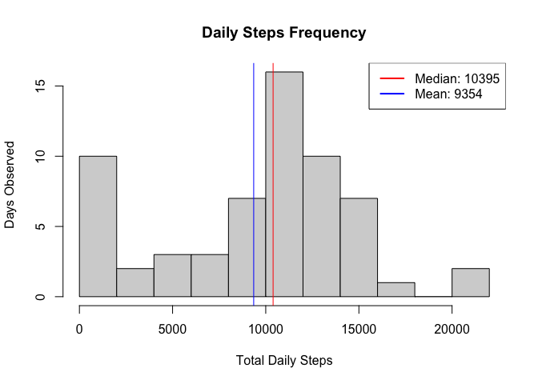
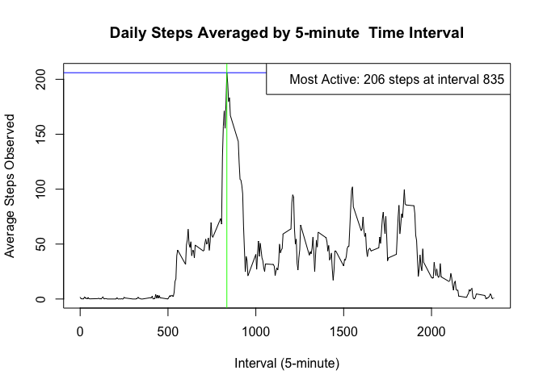
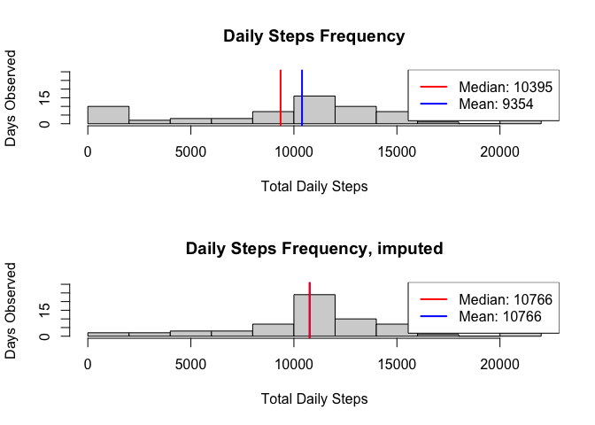
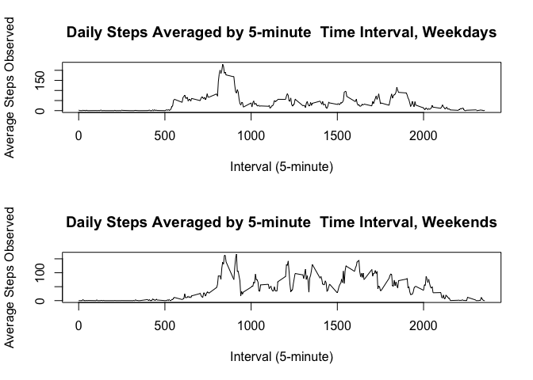

## Loading and preprocessing the data


```r
suppressMessages(library(lubridate))

fileURL<-"https://d396qusza40orc.cloudfront.net/repdata%2Fdata%2Factivity.zip"
download.file(fileURL,destfile="./data.zip",method="curl")
unzip('./data.zip', files = NULL, list = FALSE, overwrite = TRUE, junkpaths = FALSE, exdir = ".", unzip = "internal",setTimes = FALSE)
ACT<-read.csv('activity.csv')
```

## What is mean total number of steps taken per day?


```r
daysteps<-tapply(ACT$steps, ACT$date,sum,na.rm=TRUE)
daysteps_mean = round(mean(daysteps))
daysteps_median = round(median(daysteps))

hist(daysteps,breaks=10,
        main="Daily Steps Frequency",
        xlab="Total Daily Steps",
        ylab="Days Observed")
abline(v=daysteps_mean,col='blue')
abline(v=daysteps_median,col='red')
legend("topright", c(paste0("Median: ", daysteps_median), paste0("Mean: ", daysteps_mean)), col=c("red", "blue"), lwd=2)
```

<!-- -->


## What is the average daily activity pattern?


```r
intsteps<-tapply(ACT$steps, ACT$interval,mean,na.rm=TRUE)
intsteps<-as.data.frame(intsteps)
intsteps <- cbind(time = rownames(intsteps), intsteps)
intsteps_max<-round(max(intsteps$intsteps))
intsteps_maxinterval<-intsteps$time[intsteps$intsteps==max(intsteps$intsteps)]

plot(x=intsteps$time,y=intsteps$intsteps,type="l",
        main="Daily Steps Averaged by 5-minute  Time Interval",
        xlab="Interval (5-minute)",
        ylab="Average Steps Observed")
abline(h=intsteps_max,col='blue')
abline(v=intsteps_maxinterval,col='green')
legend("topright", paste("Most Active:", intsteps_max, "steps at interval", intsteps_maxinterval))
```

<!-- -->

## Imputing missing values


```r
ACT_na<-as.character(sum(!complete.cases(ACT)))
```

#### Total missing values: 2304 
#### Imputing NAs by mean interval steps:


```r
ACT_imp<-ACT
ACT_imp$steps[ACT_imp$interval == intsteps$time & is.na(ACT_imp$steps)]<-intsteps$intsteps
daysteps_imp<-tapply(ACT_imp$steps, ACT_imp$date,sum,na.rm=TRUE)
daysteps_imp_mean = round(mean(daysteps_imp))
daysteps_imp_median = round(median(daysteps_imp))

par(mfrow=c(2,1))
hist(daysteps,breaks=10,ylim=c(0, 30),
        main="Daily Steps Frequency",
        xlab="Total Daily Steps",
        ylab="Days Observed")

legend("topright", c(paste0("Median: ", daysteps_median), paste0("Mean: ", daysteps_mean)), col=c("red", "blue"), lwd=2)
abline(v=daysteps_median,col='blue',lwd=2)
abline(v=daysteps_mean,col='red',lwd=2)

hist(daysteps_imp,breaks=10,ylim=c(0, 30),
        main="Daily Steps Frequency, imputed",
        xlab="Total Daily Steps",
        ylab="Days Observed")

legend("topright", c(paste0("Median: ", daysteps_imp_median), paste0("Mean: ", daysteps_imp_mean)), col=c("red", "blue"), lwd=2)
abline(v=daysteps_imp_mean,col='blue',lwd=2)
abline(v=daysteps_imp_median,col='red',lwd=2)
```

<!-- -->

#### The imputed histogram implies a more "normally" distributed number of steps per time interval. The activity is generally low at night and in the morning, with a peak at midday. This is more reasonable than the original data.


## Are there differences in activity patterns between weekdays and weekends?


```r
ACT_imp$date<-as.POSIXlt(ymd(ACT_imp$date))
ACT_imp$day<-weekdays(ACT_imp$date)
day_levels <- c("Weekday","Weekend")
ACT_imp$day[ACT_imp$day=="Monday"|ACT_imp$day=="Tuesday"|ACT_imp$day=="Wednesday"|ACT_imp$day=="Thursday"|ACT_imp$day=="Friday"]<-"Weekday"
ACT_imp$day[ACT_imp$day=="Saturday"|ACT_imp$day=="Sunday"]<-"Weekend"
ACT_imp$day<-factor(ACT_imp$day, levels=day_levels)

ACT_imp_weekday<-subset(ACT_imp,ACT_imp$day=="Weekday")
ACT_imp_weekend<-subset(ACT_imp,ACT_imp$day=="Weekend")

intsteps_weekday<-tapply(ACT_imp_weekday$steps, ACT_imp_weekday$interval,mean)
intsteps_weekday<-as.data.frame(intsteps_weekday)
intsteps_weekday <- cbind(time = rownames(intsteps_weekday), intsteps_weekday)
intsteps_weekend<-tapply(ACT_imp_weekend$steps, ACT_imp_weekend$interval,mean)
intsteps_weekend<-as.data.frame(intsteps_weekend)
intsteps_weekend <- cbind(time = rownames(intsteps_weekend), intsteps_weekend)

par(mfrow=c(2,1))
plot(x=intsteps_weekday$time,y=intsteps_weekday$intsteps,type="l",
        main="Daily Steps Averaged by 5-minute  Time Interval, Weekdays",
        xlab="Interval (5-minute)",
        ylab="Average Steps Observed")
plot(x=intsteps_weekend$time,y=intsteps_weekend$intsteps,type="l",
        main="Daily Steps Averaged by 5-minute  Time Interval, Weekends",
        xlab="Interval (5-minute)",
        ylab="Average Steps Observed")
```

<!-- -->

#### Weekday activity is generally higher than weekend activity across all times of day.
